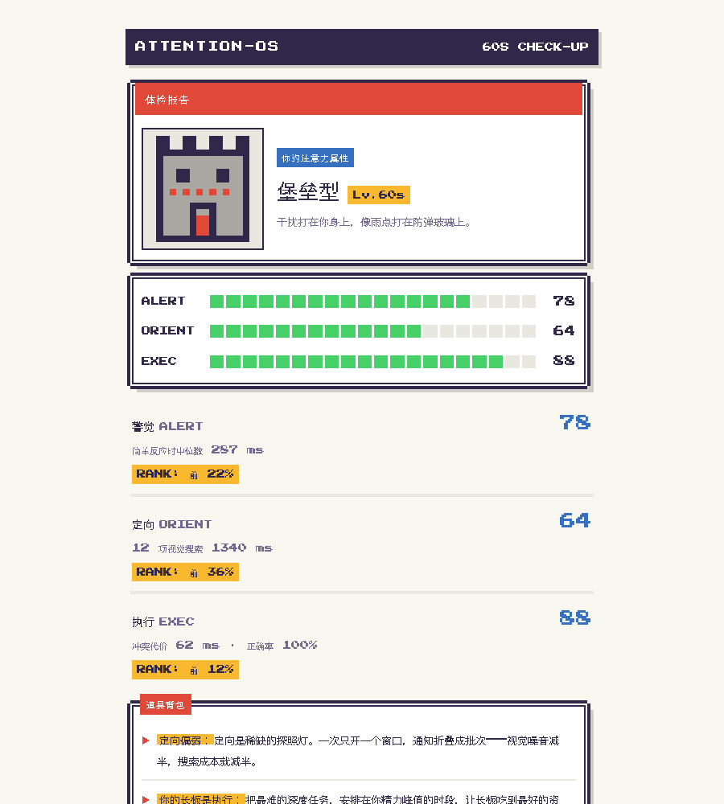
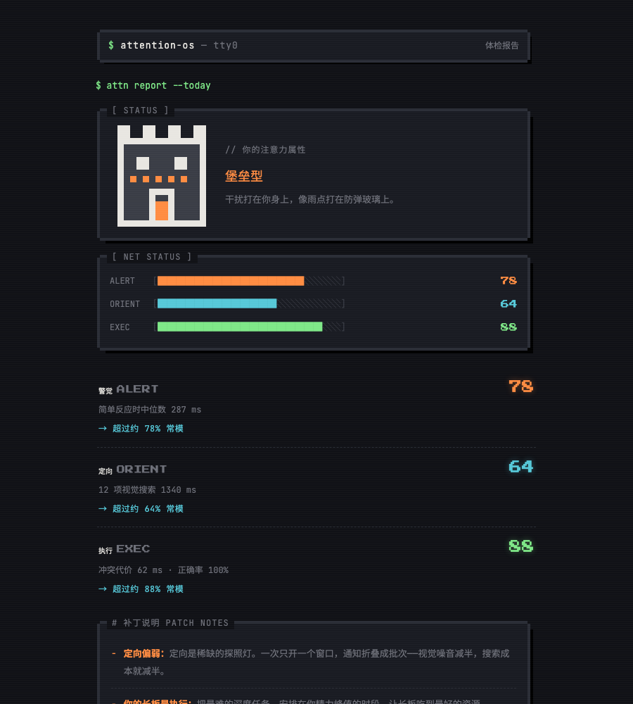
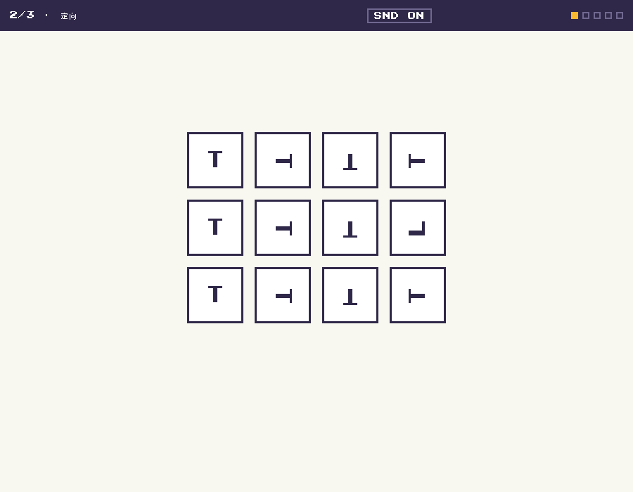

# AttentionOS

> We spent billions teaching models to attend better.
> Your attention span is still about 47 seconds.
> The bottleneck isn't the model anymore — it's you.

**60 秒，测出你的注意力类型。** 一个开源的"人类注意力观测层"：
先用 3 关小游戏给你的注意力做体检，再（roadmap）用桌宠和本地采集器
守护它。数据永远不出你的设备。

**▶ 立即游玩 / Play now: https://zhonghaozhan.github.io/AttentionOS/**

| 🕹 HANDHELD（主打） | 💻 TERMINAL |
|---|---|
| [](https://zhonghaozhan.github.io/AttentionOS/demo/gbc.html) | [](https://zhonghaozhan.github.io/AttentionOS/demo/terminal.html) |
| 彩色掌机 RPG · 训练师卡 | 深色街机终端 · `$ attn check-up` |

*Attention is all you need. Yours. Not the model's.*

## 它在测什么 / What it measures

三关分别对应 Posner & Petersen (1990) 的三大注意力网络（ANT 范式，
Fan et al. 2002），全程实时评分、连击、音效、过关结算：

1. **警觉 Alerting** — 信号一亮立刻出手（简单反应时）
2. **定向 Orienting** — 在随机旋转的 T 群里找到同样被旋转的 L（串行视觉搜索）
3. **执行 Executive** — 顶住两侧箭头的干扰，只回答中间（Eriksen flanker 冲突代价）



结果映射到文献常模的近似百分位，产出你的**注意力类型**
（猎豹 / 鹰眼 / 堡垒 / 指挥官 / 均衡 / 漫游者）+ 三维属性 + 本周注意力处方，
并生成可下载的训练师卡。完整公式、常模来源与诚实的局限性：
[docs/SCIENCE.md](docs/SCIENCE.md)。

纯浏览器运行：无账号、无埋点、无网络请求。双语（中/EN，右上角切换）。

## 产品阶梯 / The ladder

| 档位 | 形态 | 状态 |
|---|---|---|
| **AttentionOS mini** | 60s 浏览器体检（本页 demo） | ✅ 可玩 |
| **AttentionOS** | 桌宠 + GUI Dashboard + 本地采集器（[desktop/](desktop/)） | 🛠 可跑：六物种、边缘挂靠、心流隐身、25min 休息邀请、五指标报告 |
| **AttentionOS Pro** | CLI + MCP server + agent skill + ASCII 宠物（`attn pet`） | 🛠 CLI 可用，MCP 设计中 |

测完点「复制存档码」→ 桌宠端双击宠物粘贴导入，你的类型就是它的物种。

测试结果通过**存档码**（`attn1.…`）/ deep link / QR 传给桌面端：你的类型
决定宠物物种，三网分数是初始属性，最弱的网络成为宠物的训练方向。
设计细节：[docs/TIERS.md](docs/TIERS.md)。

## `attn` — CLI 原型

本地优先的注意力采集器（macOS）：

```sh
cd cli
python3 attn.py demo      # 生成一天合成数据，立即体验
python3 attn.py report    # htop 式注意力日报
python3 attn.py collect   # 真实采集（数据只写本地 SQLite）
```

五个开放指标（Focus Half-Life、Context Switch Rate、Interrupt Load、
Attention Budget、Recovery Debt）定义于 [docs/METRICS.md](docs/METRICS.md)。

## 原则 / Principles

- **本地优先，永远。** 注意力数据不出设备；分享只在你主动导出时发生。
- **无生物特征。** 只看窗口焦点与输入节奏，不碰摄像头和穿戴设备。
- **保护性，而非榨取性。** 这是一份"谁在掠夺你的注意力"的审计，
  不是交给老板的生产力评分。
- **反燃尽为一等公民。** 无视热管理的系统会烧掉芯片。

## Contributing

觉得测得准？点个 Star 就是对开源最好的投喂。
觉得指标定义不对？开 issue 吵——词汇表本身就是这个项目的核心产出。

MIT licensed.
